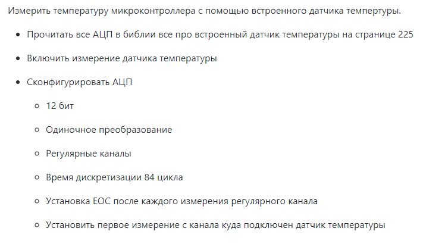
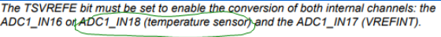
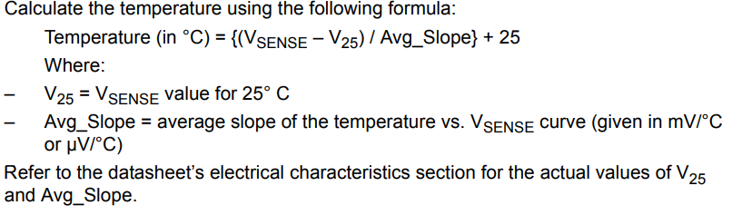
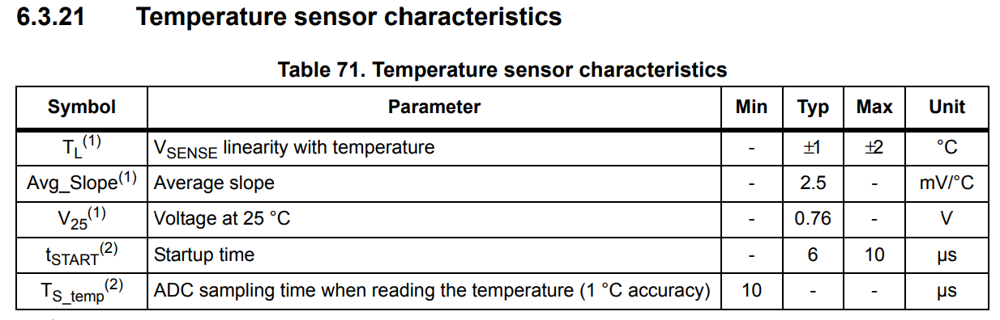
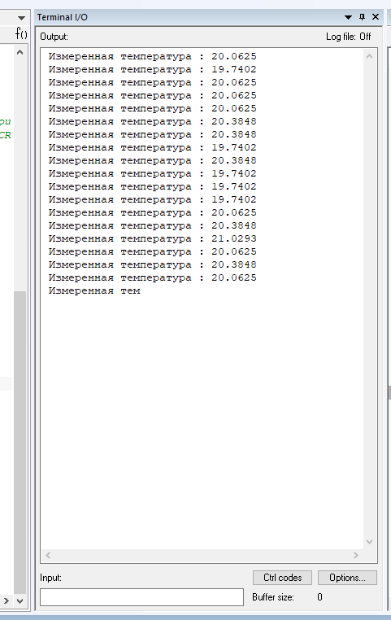

== Работа в IAR Embedded Workbench

=== Работа с температурным датчиком

Задание:

.Задание

= *Ход работы:*

Целью данной лабораторной работы было создание устройства, способного *считывать значения температуры* и передавать их
пользователю в консоль.

Для правильной работы устройства был составлен *следующий алгоритм*:

- *RCC::APB2ENR::ADC1EN::Enable::Set();*  _Подключаем АЦП к источнику тактирования_;
- *ADC1::SQR3::SQ1::Channel18::Set();*  _Конфигурируем порты ( в нашем случае 18 канал, именно на нем у нас темп. сенсор)._

- *ADC_Common::CCR::TSVREFE::Enable::Set();* _Будим температурный сенсор, чтоб он работал._
- *Работаем с АЦП:*
----
ADC1::CR1::RES::Bits12::Set(); // Ставим разрядность АЦП — 12.
ADC1::CR2::CONT::SingleConversion::Set(); // Режим одиночного преобразования
ADC1::CR2::EOCS::SingleConversion::Set(); // Режим одиночного преобразования
ADC1::SQR1::L::Conversions1::Set(); // Количество измерений  = 1
ADC1::SMPR1::SMP18::Cycles84::Set(); // Скорость дискретизации ставим.
ADC1::CR2::ADON::Enable::Set(); // После этого включаем АЦП
----
- Затем в Main()  пишем *ADC1::CR2::SWSTART::On::Set();* тем самым запускаем на преобразование *АЦП*.
- В цикле for(;;) запишем проверяем, произошло ли измерение и запрашиваем бит из регистра Data.

_Также, для правильного отображения температуры, нужно перевести полученные с устройства данные в
данные, понятные для пользователя._

Для этого используем формулу из *Datasheet*:

.Формула

Заглянем в *Datasheet* и найдем необходимые данные:

.Смотрим в документацию

Подставляем значения в формулу и записываем в код. Рабочая программа выдаёт следуюшие показания:

.Программа в работе

Код программы:
[source, cpp]
----
#include <cstdint>            //for int types such as uint32_t
#include "gpioaregisters.hpp" //for Gpioa
#include "gpiocregisters.hpp" //for Gpioc
#include "gpiobregisters.hpp" //for Gpiob
#include "rccregisters.hpp"   //for RCC
#include "tim2registers.hpp"   //for SPI2
#include "nvicregisters.hpp"  //for NVIC
#include "adc1registers.hpp"
#include "adccommonregisters.hpp"
#include <iostream>

extern "C"
{
  int __low_level_init(void)
  {
    RCC::CR::HSEON::On::Set();
    while (!RCC::CR::HSERDY::Ready::IsSet())
    {
    }
    RCC::CFGR::SW::Hse::Set();

    while (!RCC::CFGR::SWS::Hse::IsSet())
    {
    }
    RCC::CR::HSION::Off::Set();

    RCC::AHB1ENR::GPIOAEN::Enable::Set();
    RCC::AHB1ENR::GPIOCEN::Enable::Set();
    GPIOC::MODER::MODER5::Output::Set();
    GPIOA::MODER::MODER5::Output::Set();
    GPIOC::MODER::MODER9::Output::Set();
    GPIOC::MODER::MODER8::Output::Set();

    RCC::APB2ENR::ADC1EN::Enable::Set();
    ADC1::SQR3::SQ1::Channel18::Set();                                  //Select ADC1_IN16 or ADC1_IN18 input channel
    ADC_Common::CCR::TSVREFE::Enable::Set();                            //Set the TSVREFE bit in the ADC_CCR register to wake up the temperature sensor
    ADC1::CR1::RES::Bits12::Set();
    ADC1::CR2::CONT::SingleConversion::Set();
    ADC1::CR2::EOCS::SingleConversion::Set();
    ADC1::SQR1::L::Conversions1::Set();
    ADC1::SMPR1::SMP18::Cycles84::Set();

    ADC1::CR2::ADON::Enable::Set();

  }
}

   float V25 = 0.76F;
   float AVG_Slope = 0.0025F;
   float Temperature = 0.0F;

int main()
{

  for(;;)
  {
    ADC1::CR2::SWSTART::On::Set();
     while(!ADC1::SR::EOC::ConversionComplete::IsSet())
    {
    };
  uint32_t data =   ADC1::DR::Get(); //Get data from ADC;
  Temperature = ((((data*3.3)/4096 - V25)/AVG_Slope) + 25.0);
  std::cout << " Измеренная температура : " <<  Temperature << std::endl;
  }
}
----

